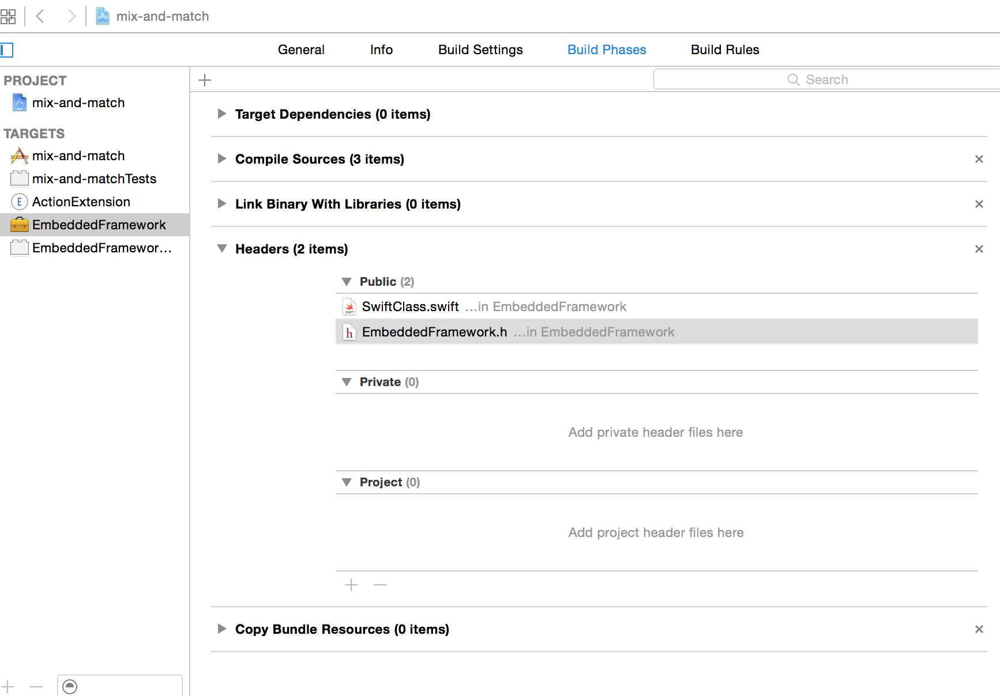
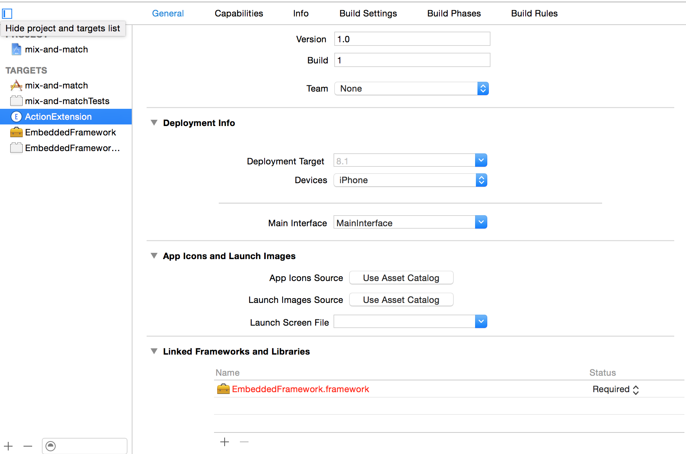

mix-and-match
===

概要
---

[公式ドキュメント: Swift and Objective-C in the Same Project][Official] のサンプル的な実装

具体的には下記をしている

+ Embedded Framework の 
	+ Objective-C から Embedded Framework の Swift をコールする
	+ Swift から Embedded Framework の Objective-C をコールする
+ Action Extension 内の Swift から
	+ Embedded Framework の Swift をコールする
	+ Embedded Framework の Objective-C をコールする

作成手順
---

### Embedded Framework Target の作成

1. EmbeddedFramework Target を作る
	1. File > New > Target
	2. Framework & Library > Cocoa Touch Framework
	3. Target の名前は EmbeddedFramework にしました。言語は Swift にしました。
2. Framework を実装する
	+ [ObjcClass.h][]
	+ [ObjcClass.m][]
		+ ポイントは `#import <EmbeddedFramework/EmbeddedFramework-Swift.h>`
			+ 詳細は[公式ドキュメント][Official]の **To import Swift code into Objective-C from the same framework** の項参照
	+ [SwiftClass.swift][]
		+ ポイントは2点
			+ `@objc`
			+ クラス、イニシャライザ、公開API のスコープを明示的に public 宣言
				+ [Can't access Swift class from custom dynamic framework (iOS) - Stack Overflow](http://stackoverflow.com/questions/25823542/cant-access-swift-class-from-custom-dynamic-framework-ios)
				+ [The Swift Programming Language: Access Control](https://developer.apple.com/library/ios/documentation/swift/conceptual/Swift_Programming_Language/AccessControl.html)
3. Xcode が自動生成した [EmbeddedFramework.h](./EmbeddedFramework/EmbeddedFramework.h) (umbrella header というそうな) に import 宣言を追加
	+ `#import <EmbeddedFramework/ObjcClass.h>`
4. [SwiftClass.swift][] を Public にする
	
5. Build Settings の Defines Modules の値を YES に変更する
	+ [公式ドキュメント][Official] の **Importing External Frameworks** の項参照


### Action Extension Target の作成

1. ActionExtension Target を作る
	1. File > New > Target
	2. Aplication Extension > Action Extension
	3. Target の名前は ActionExtension にしました。言語は Swift にしました。
2. Linked Frameworks and Library に 上で作成した EmbeddedFramework を追加する
	
	NOTE: 赤字になっているけど実機ビルドしたタイミングで黒字になるので気にしなくて OK
3. Xcode が自動生成した [ActionViewController.swift] に import 宣言を追加 
	+ `import EmbeddedFramework`
4. Embedded Framework の API をコールする
5. 下記のログが Console に出力されれば OK

```
        var swift = SwiftClass()
        swift.run()
    
        var objc = ObjcClass()
        objc.run()
```

[Official]:https://developer.apple.com/library/ios/documentation/Swift/Conceptual/BuildingCocoaApps/MixandMatch.html
[ObjcClass.h]:./EmbeddedFramework/ObjcClass.h
[ObjcClass.m]:./EmbeddedFramework/ObjcClass.m
[SwiftClass.swift]:./EmbeddedFramework/SwiftClass.swift
[ActionViewController.swift]:./ActionExtension/ActionViewController.swift


実行
---

1. Scheme を ActionExtension > iPhone 6 として実行
2. Choose an app to run で Safari を選択
3. 適当な Web ページを表示して
4. Action ボタンをタップ
5. ActionExtension ボタンをタップ


```
2014-12-03 12:03:30.359 ActionExtension[25136:2492371] call Objc from Swift in Embedded Framework
2014-12-03 12:03:30.359 ActionExtension[25136:2492371] call Swift from Objc in Embedded Framework
```


Embedded Framework での Cocoapods の使用について
---

Podfile

``` 
source 'https://github.com/CocoaPods/Specs.git'
platform :ios, "8.1"

link_with 'EmbeddedFramework'
pod "AFNetworking"
```

こんな感じ Podfile で `pod install` して umbrella header に

`#import <AFNetworking/AFNetworking.h>` 

を記述したところ下記のエラーがでます。

```
Swift Compiler Error
Include of non-modular header inside framework module 'StackKit'
```

### 環境

+ Xcode 6.1
+ cocoapods 0.35.0.rc2

どうやら EmbeddedFramework で Cocoapods と Swift を併用するには cocoapods 0.36 を待つ必要があるみたい。


+ [CocoaPods Is Ready for Swift - Swift Wala](http://swiftwala.com/cocoapods-is-ready-for-swift/)

上記リンク先の Gemfile で開発中のものを Install してみましたが、状況改善しませんでした。


### Workaround

Workaround ですらないんだけど、EmbeddedFramework から Swift の実装を消したところこのエラーは解消されました。
つまり Embedded Framework は Objective-C のみで記述するのがとりあえずの解決策（解決してない）。

Embedded Framework を Objective-C でのみ記述した実装例は Qiita でも公開されていました。

+ [Xcode - App ExtensionでCocoaPods管理しているライブラリを使用する2つの方法 - Qiita](http://qiita.com/tmnb/items/15377f03498ca0b53592)


### 関連 Issues

+ [Support Clang Modules / Frameworks ( swift ) · Issue #2272 · CocoaPods/CocoaPods](https://github.com/CocoaPods/CocoaPods/issues/2272)

